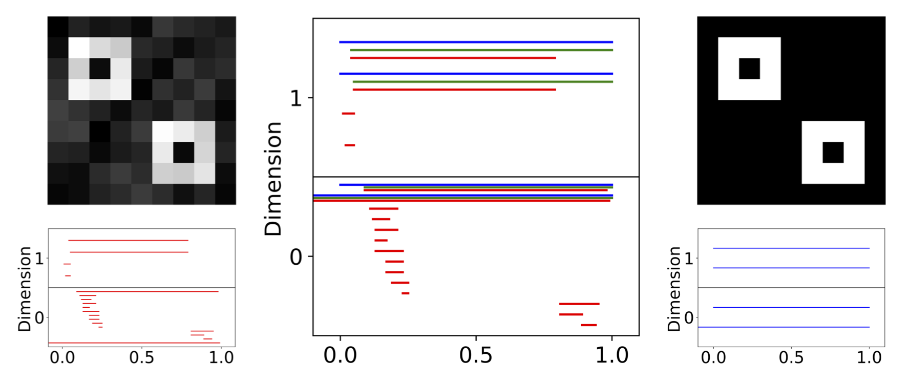
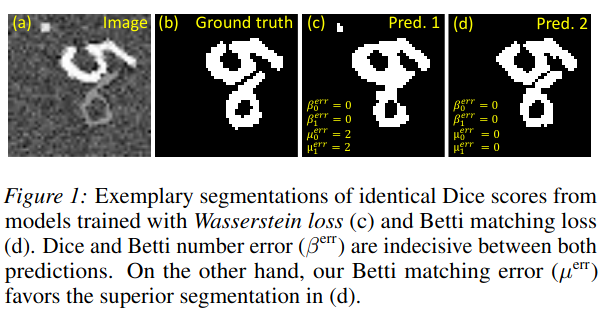
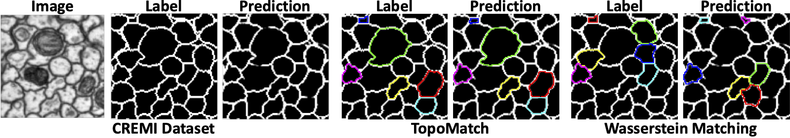

**Betti matching**: Topological loss and metric for 2D image segmentation
========

**What is Betti matching?** The topology of images is best captured by persistent homology, which can be represented in form of persistence barcodes. An interval in the barcode represents a topological feature, e.g. a connected component in dimension 0 or a loop in dimension 1. 



Betti matching is a framework, based on the theory of induced matchings (see https://arxiv.org/abs/1311.3681), that matches intervals representing topological features, which sptially correspond to each other. It defines the Betti matching loss, which enforces topologically accurate image segmentations during training. The Betti matching error additionally serves as a metric for the evaluation of segmentation tasks. It can be seen as a refinement of the well-established Betti number error by counting the features in both images that do not spatially correspond to a feature in the other image.



**About the code**. We have provided the source code of Betti matching along with instructions for the training and evaluation scripts. Furthermore we have provided an extended implementation of the Wasserstein matching (see https://github.com/HuXiaoling/TopoLoss), which additionally matches intervals in dimension 0. The introduction.ipynb notebook introduces the implemented functions and visualizes the improvements of the Betti matching over the traditional Wasserstein Matching. 



The train.py and evaluation.py files can be used to reproduce our experiments. We also provide examplary images and labels for all datasets in the data folder. Note that you can download the trained models and the full datasets from [here](https://doi.org/10.5281/zenodo.7312139). 

 Please follow the procedure below.


## Usage

### Installation of required packages in virtual environment

1.) Download venv package virtual environment (venv): python3 -m pip install --user virtualenv

2.) Create a virtual environment: python3 -m venv venv

3.) Activate virtual environment: source venv/bin/activate

4.) Install requests package: python -m pip install requests

5.) Use requests to install required packages: pip install -r requirements.txt

### Use the virtual environment in Jupyter Notebook

6.) Install ipykernel: pip install --user ipykernel

7.) python -m ipykernel install --user --name=BettiMatching

8.) Activate BettiMatching as kernel in Jupyter Notebook

### Usage of Betti matching:
For a detailed explanation and introduction to Betti matching we refer to the Jupyter Notebook introduction.ipynb, which introduces the most important functions of the BettiMatching class and the CubicalPersistence class.

### Training
1.) To train from scratch using CPU:

python3 train.py --config configs/cremi_config.yaml --dataconfig configs/cremi_dataconfig.yaml

2.) To train from scratch using GPU:

python3 train.py --config configs/cremi_config.yaml --dataconfig configs/cremi_dataconfig.yaml --cuda_visible_device 2

3.) To resume training:

python3 train.py --config configs/cremi_config.yaml --dataconfig configs/cremi_dataconfig.yaml --cuda_visible_device 2 --resume models/cremi/Topo_superlevel_relative_False_alpha_0.5/best_model_dict.pth

4.) To use a pretrained model:

python3 train.py --config configs/cremi_config.yaml --dataconfig configs/cremi_dataconfig.yaml --cuda_visible_device 2 --pretrained models/cremi/Dice/best_model_dict.pth

### Evaluation
1.) To evaluate a trained model saved in location ./models/cremi using CPU:

python3 evaluate.py --folder ./models/cremi --config configs/cremi_config.yaml --dataconfig configs/cremi_dataconfig.yaml

2.) To evaluate a trained model saved in location ./models/cremi using GPU:

python3 evaluate.py --folder ./models/cremi --config configs/cremi_config.yaml --dataconfig configs/cremi_dataconfig.yaml --cuda_visible_device 2


<!-- ## Citing Betti matching
If you find our repository useful in your research, please cite the following:
```bibtex
@article{
}
``` -->

<!-- # License
-->

# Acknowledgement
We acknowledge the following repositories from where we have inherited code snippets or copied implementation details:

1. ClDice: [[code](https://github.com/jocpae/clDice)][[paper](https://arxiv.org/abs/2003.07311)]
2. TopoLoss: [[code](https://github.com/HuXiaoling/TopoLoss)][[paper](https://arxiv.org/abs/1906.05404)]

<!-- # Contributing
We actively welcome your pull requests! Please see [CONTRIBUTING.md](.github/CONTRIBUTING.md) and [CODE_OF_CONDUCT.md](.github/CODE_OF_CONDUCT.md) for more info. -->
